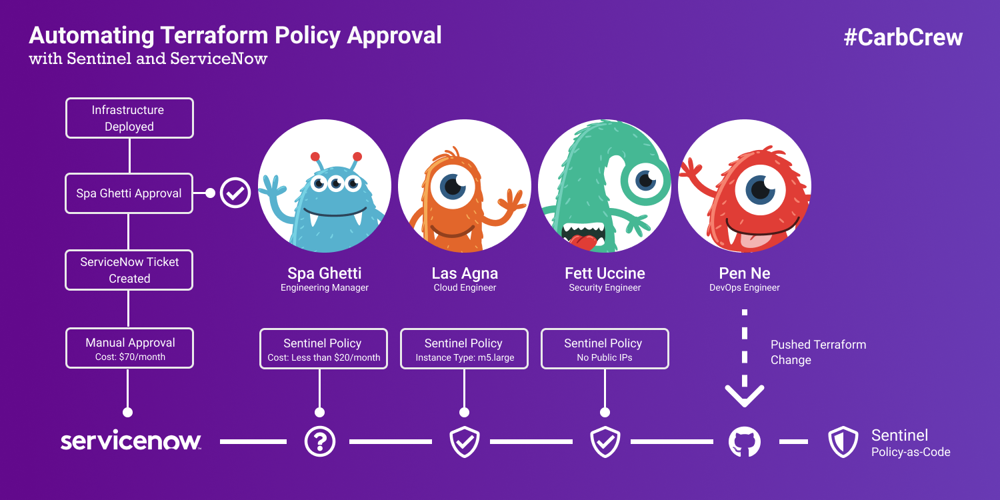
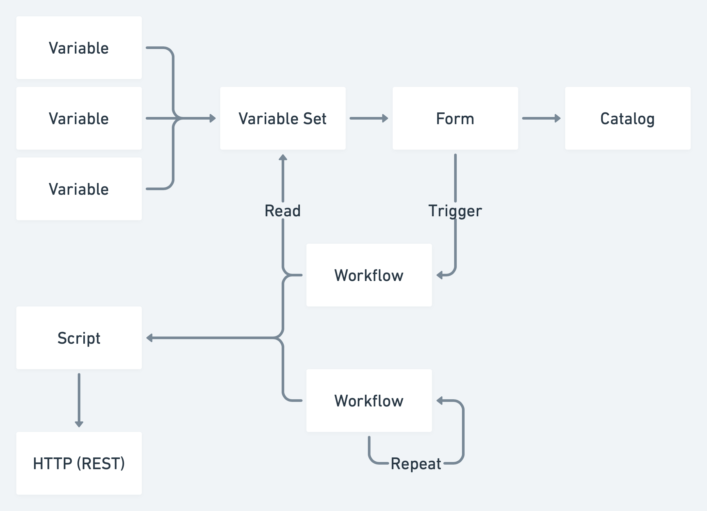

# What is this?

    

HashiCorp recently created a Terraform ServiceNow integration, which provides essential building blocks for integrating Terraform and ServiceNow. The GIF above depicts the end result and functionally, the following actions.

1. Creating a Workspace with ServiceNow
2. Adding AWS Credentials and an instance_type in Terraform Cloud
3. Manually triggering a Terraform Run
4. Sentinel forces a policy override due to the Terraform plan having a monthly cost of more than $20/month
6. A manual approval request is created for Spa Ghetti in ServiceNow
7. We manually approve the request in ServiceNow
8. A REST request is made to the Terraform Policy Override API

[Check out the Blog Post on Medium!](https://medium.com/p/830fad580bfa/edit)

# Building Blocks

The Terraform ServiceNow Integration builds on top of a few generic constructs from ServiceNow's API. 

**Catalog:** Catalogs are a top-level collection which provides an entry point for users to interact with the integration.

**Variables and Variable Sets:** Variables and by extension, Variable Sets are embedded within Forms and provide fields for users to enter data. This could be anything from collecting AWS IAM credentials to Workspace names.

**Workflows:** Workflows allow users to embed an ECMA5 script that can access variables from the invoking object. The two types of workflows utilized in this integration are scheduled on an interval and triggered manually. This allows users to interact with the Terraform API in the form of polling and implicitly.
Polling allows us to continuously grab that latest status of a workspace and synchronize that with ServiceNow. Similarly, manual triggers allow users to create workspaces and, in our case, trigger policy overrides.

**Scripts:** Scripts are pieces of code that need to be shared across workflows. In our case, the integration is utilizing Scripts to wrap the Terraform API interactions in functions that are called from running Workflows.

**REST Messages:** REST Messages are the last major block and define the available REST requests. This includes setting Headers, Parameters, Method, and more.

# Installation

## Setting Up Terraform Cloud

    

For simplicity, we are going to use Terraform Cloud with an Enterprise Trial. However, if you're using a Terraform Enterprise installation you would follow the same steps.

1. Once you've logged in, you'll want to create a new Terraform organization. I called it service-now-test but feel free to name it anything.
2. Navigate to the Organization Settings tab which is located at the top of the screen.
3. Enable the 30 day Enterprise Trial for the organization that you created.
4. Create a Service Now team within this organization and enable Manage Policies and Manage Workspaces.
5. Navigate to the API Tokens page, generate an organization token and save it somewhere locally.

## Setting up GitHub VCS Connection to Terraform Cloud

    

1. Navigate to the VCS Providers page and Add a GitHub OAuth Provider.
2. Navigate to your GitHub Settings Page
3.  Click on Developer Settings
4. Click on OAuth Apps
5. Create a New OAuth App
6. Name it Terraform Cloud
7. Set Homepage URL to https://app.terraform.io or your Terraform Enterprise endpoint
8. Set Authorization Callback URL to https://app.terraform.io
9. Copy the OAuth Client ID and Client Secret into Terraform Cloud's respective inputs
10. Click on the Connect organization service-now-example wbutton
11. Copy the Callback URL from the newly added Terraform Cloud VCS Provider
12. Enter the copied callback URL into your GitHub App's Authorization callback URL and hit save.
13. Copy and save the OAuth Token ID from Terraform Cloud

## Installing the Terraform ServiceNow Application

    

You'll need to request the Terraform Service Now Integration repo from HashiCorp which you can then include in a personal or company VCS repository.
1. Create an account at developer.servicenow.com
2. Request a Madrid Instance from the Developer Portal
3. Log into the ServiceNow Account
4. Filter for "Studio" using the left hand search bar
5. Select "Import from Source Control"
6. Enter the GitHub URL
7. Enter your username
7. Generate a Personal Access Token from GitHub
8. Enter the Personal Access Token as your Password

# Customization

## Add Spa Ghetti

    

1. Use the Left Hand Search Bar to filter for Users
2. Select the Users result under Organization
3. Click New at the top of the Content Pane
4. Set User ID: `spa.ghetti`
5. Set First Name: `Spa`
6. Set Last Name: `Ghetti`
7. Click Submit

## Add Policy Override REST Message

    

1. Navigate to the Studio
2. Select the Terraform Integration
3. Select Create Application File from the Top Left
4. Search for and select `REST Message`
5. Name it `TF Policy Checks`
6. Enter `${hostname}/api/v2/policy-checks` as the Endpoint
7. Select the `HTTP Request Tab`
8. Add an `Authorization` Header with the value of `Bearer ${api_team_token}`
9. Add a `Content-Type` Header with the value of `application/vnd.api+json`
10. Click Submit
11. Delete the `Default GET` HTTP Method
12. Create a new HTTP Method
13. Name it `Override Policy`
14. Enter `${hostname}/api/v2/policy-checks/${policy_check_id}/actions/override` as the Endpoint
15. Select `POST` as the HTTP Method
16. Click Submit
17. Add a Variable Substitution called `api_team_token` and select Submit
18. Add a Variable Substitution called `policy_check_id` and select Submit

## Add TF_Policy Script

    

1. Navigate to the Studio
2. Select the Terraform Integration
3. Select Create Application File from the Top Left
4. Search for and select `Script Include`
5. Name it `tf_policy`
6. Paste the contents of `service_now/script_tf_policy.js` into the Script section
7. Click Submit

## Update Poll Run State

    

1. Navigate to the Studio
2. Select the Terraform Integration
3. Scroll to the Bottom and select the `Poll Run State` Workflow
4. Select the Left Hand Hamburger Menu
5. Click Checkout
6. Paste the contents of `service_now/wf_poll_run_state.js` into the Script section
7. Select the Left Hand Hamburger Menu
8. Click Publish
9. Select `Worker Poll Run State` under Workflow Schedule
10. Select `Periodically` from the Run dropdown
11. Click Update

# Configuration

## Add a Terraform API Config

    

1. Utilize the left hand search bar to search for Terraform
2. Select Configs
3. Enter the API Organization Token that we saved earlier
4. Enter the name of your Terraform Organization, mine was `service-now-example`

## Add a Terraform VCS Repository

    

1. Utilize the left hand search bar to search for Terraform
2. Select VS Repositories
3. Name it Terraform Example
4. Enter `peytoncasper/terraform-servicenow-example` into the Identifier
5. Enter the GitHub OAuth token from earlier

## Add the Terraform Service Catalog

    

1. Utilize the left hand search bar to search for `Service Catalog`
2. Select `Catalogs` under `Service Catalog`
2. Click the `+` in the upper right 
3. Select `Terraform Catalog`
4. Click Add Here

# Action!

1. Utilize the left hand search bar to search for `Service Catalog`
2. Select `Catalogs` under `Service Catalog`
3. Select the `Terraform Catalog`
4. Select `Create Workspace`
5. Select `Order Now`
6. Navigate to Terraform Cloud
7. Select the Workspace
8. Add a `AWS_ACCESS_KEY_ID` Environment Variable
9. Add a `AWS_SECRET KEY` Environment Variable
10. Add an `instance_type` Terraform Variable with a value of `m5.large`
11. Queue a Terraform Apply
12. Wait for the `Soft Policy Check`
13. Refresh the ServiceNow Request and Navigate to the Approval that was added
14. Approve it
15. Sit back and watch Terraform process the Override Request!

# Resources
[1] https://www.terraform.io/docs/cloud/integrations/service-now/index.html
 