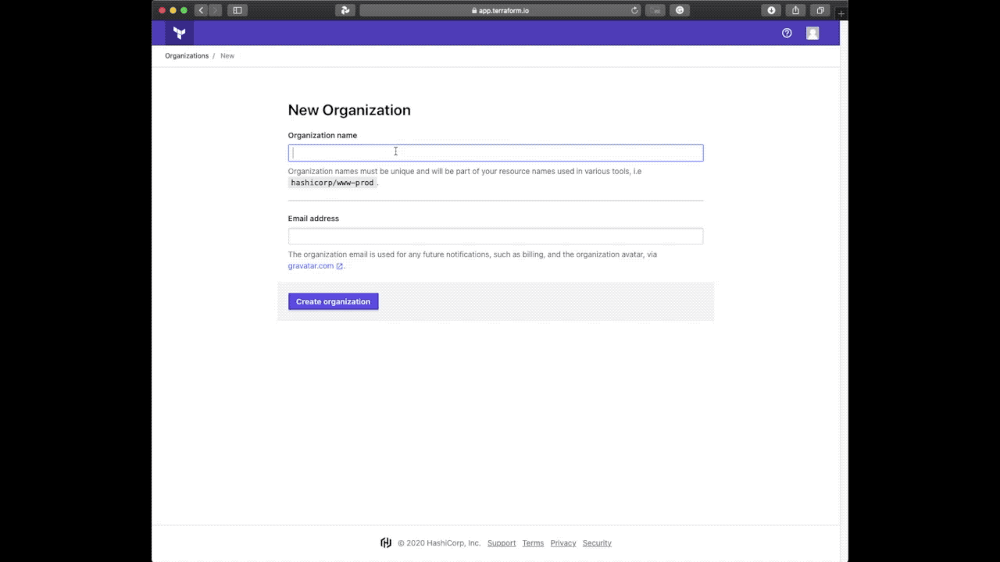
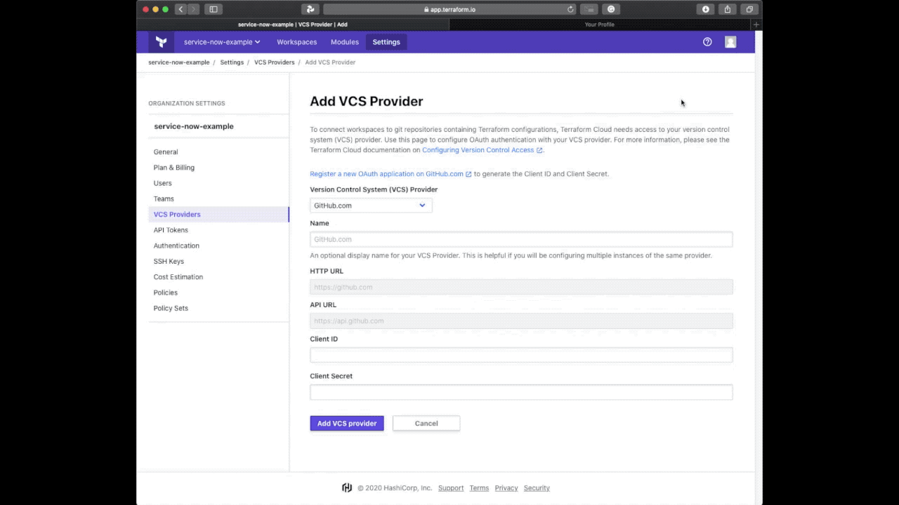

https://docs.servicenow.com/bundle/madrid-application-development/page/build/applications/task/t_AccessStudio.html

https://www.terraform.io/docs/cloud/integrations/service-now/index.html

# Setting Up Terraform Cloud

    

For simplicity, we are going to use Terraform Cloud with an Enterprise Trial. However, if you're using a Terraform Enterprise installation you would follow the same steps.

1. Once you've logged in, you'll want to create a new Terraform organization. I called it service-now-test but feel free to name it anything.
2. Navigate to the Organization Settings tab which is located at the top of the screen.
3. Enable the 30 day Enterprise Trial for the organization that you created.
4. Create a Service Now team within this organization and enable Manage Policies and Manage Workspaces.
5. Navigate to the API Tokens page, generate an organization token and save it somewhere locally.

# Setting up GitHub VCS Connection to Terraform Cloud

    

1. Navigate to the VCS Providers page and Add a GitHub OAuth Provider.
2. Navigate to your GitHub Settings Page
3.  Click on Developer Settings
4. Click on OAuth Apps
5. Create a New OAuth App
6. Name it Terraform Cloud
7. Set Homepage URL to https://app.terraform.io or your Terraform Enterprise endpoint
8. Set Authorization Callback URL to https://app.terraform.io
9. Copy the OAuth Client ID and Client Secret into Terraform Cloud's respective inputs
10. Click on the Connect organization service-now-example button
11. Copy the Callback URL from the newly added Terraform Cloud VCS Provider
12. Enter the copied callback URL into your GitHub App's Authorization callback URL and hit save.
13. Copy and save the OAuth Token ID from Terraform Cloud

# Installing the Terraform ServiceNow Application
Create an account at developer.servicenow.com
Request a Madrid Instance from the Developer Portal

Sentinel Policies
The 
Walk Through Terraform ServiceNow Project
Setting Up Terraform Cloud
ServiceNow Developer Account
Installing Terraform ServiceNow Integration
Add Spa Ghetti User
Status Check 
Talk about Variable Sets
Talk About Catalog Items
Talk about Workflows
Talk about REST Messages
Talk about Script Includes

Add tf_policy Script
Add TF Policy REST Message
Add Custom Workflow
Conclusion